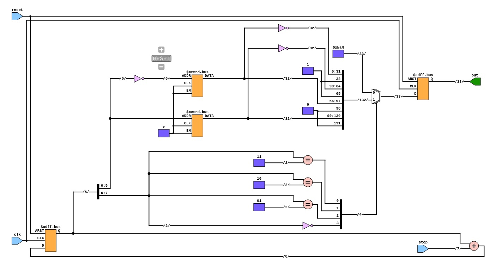
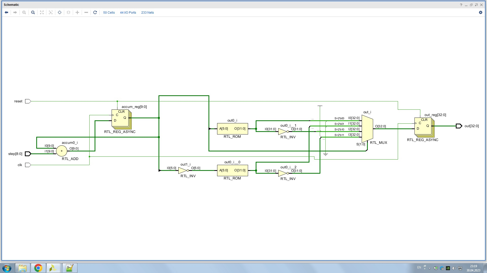
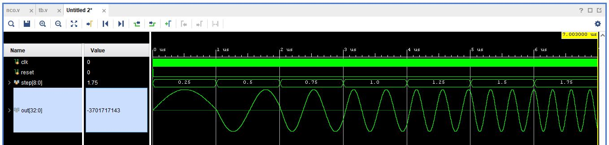

# Проектирование LUT-based NCO

### Первый этап

Для проектирования NCO необходимо предварительно озаботиться наличием оцифрованной синусоиды, поэтому с среде Matlab был создан скрипт, который генерировал четверть периода синусоиды и оцифровывал её с точностью в 32 бита. 
Далее представлен код модуля NCO.

```verilog
module NCO(
  input clk, reset,
  input  wire signed [ACC_SIZE - 1 + 1 : 0] step,
  output reg  signed [LUT_WIDTH  + 1 - 1 : 0] out );
  
  parameter LUT_WIDTH  = 32; // разрядность отсчётов синусоиды
  parameter LUT_LENGTH = 6; // глубина адресации памяти
  localparam PHASE_BITWIDTH_INTEGER = LUT_LENGTH; // целая часть указателя памяти
  localparam PHASE_BITWIDTH_FRACTIONAL = 2; // дробная часть указателя памяти
  localparam ACC_SIZE = PHASE_BITWIDTH_INTEGER + PHASE_BITWIDTH_FRACTIONAL; // общая длина указателя
  
  reg signed [ACC_SIZE + 1 : 0] accum; // регистр-указатель
  reg        [LUT_WIDTH  - 1 : 0] LUT [2**LUT_LENGTH - 1 : 0]; // память
  
  initial begin
    $readmemb("lut.mem", LUT); // инициализация значений
  end
  
  always @(posedge clk or posedge reset) // описание работы указателя
    begin
      if (reset)
        accum <= 0;
      else 
        accum <= accum + step;
    end
          
  always @(posedge clk or posedge reset) // описание работы выхода
    if (reset)
      out <= 0;
    else
      begin
        case (accum[ACC_SIZE + 1 : ACC_SIZE])
          2'b00: 
            out <= {1'b0, LUT[accum[ACC_SIZE - 1 : PHASE_BITWIDTH_FRACTIONAL]]};
          2'b01: 
            out <= {1'b0, LUT[~accum[ACC_SIZE - 1 : PHASE_BITWIDTH_FRACTIONAL]]};
          2'b10: 
            out <= {1'b1, ~LUT[accum[ACC_SIZE - 1 : PHASE_BITWIDTH_FRACTIONAL]]};
          2'b11: 
            out <= {1'b1, ~LUT[~accum[ACC_SIZE - 1 : PHASE_BITWIDTH_FRACTIONAL]]};
        endcase
      end

endmodule
```

Данное описание NCO расширением TerosHDL синтезируется в следующую схему.

<div align="center">
    <figure >
    
    <figcaption><center>Рисунок 1. Схема NCO в TerosHDL.</center></figcaption>
    </figure>
</div>

Также расширение даёт следующую оценку используемым ресурсам:

```
=== NCO ===

   Number of wires:                 16
   Number of wire bits:            229
   Number of public wires:           5
   Number of public wire bits:      50
   Number of memories:               1
   Number of memory bits:         2048
   Number of processes:              0
   Number of cells:                 14
     $add                            1
     $adff                           2
     $eq                             3
     $logic_not                      1
     $meminit_v2                     1
     $memrd                          2
     $not                            3
     $pmux                           1
```

В Vivado RTL Schematic выглядит почти идентично.

<div align="center">
    <figure >
    
    <figcaption><center>Рисунок 2. RTL Schematic NCO в Vivado.</center></figcaption>
    </figure>
</div>

Наличие дробной части позволяет получать на выходе NCO синусоиду с частотой равной частоте дискретизации, умноженной на коэффициенты 0.25, 0.5, 0.75, 1, 1.25 и так далее. 
Полученные синусоиды показаны на рисунке ниже. 

<div align="center">
    <figure >
    
    <figcaption><center>Рисунок 3. Тестирование NCO.</center></figcaption>
    </figure>
</div>

Стоит отметить, что число используемых разрядов после запятой полностью параметризировано и может изменятся одним параметром для достижение необходимой точности. 

https://docs.xilinx.com/v/u/en-US/xapp052
