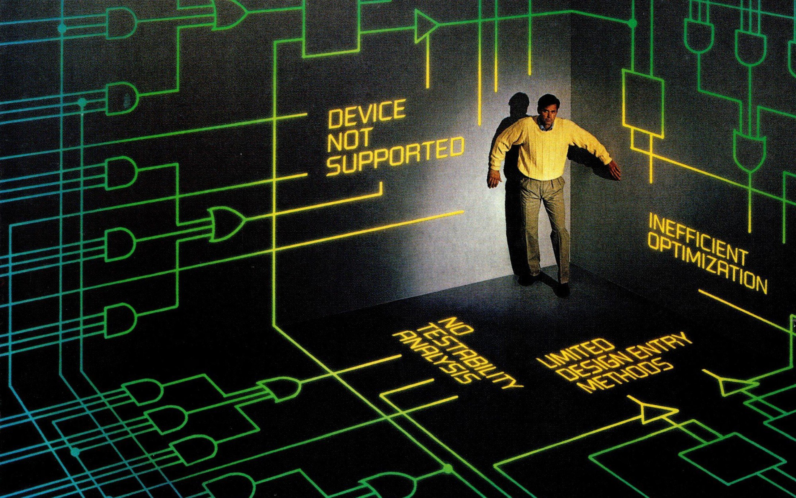

# Портфолио личных проектов 

## Лоос Владислав, студент магистратуры кафедры ТКС НИУ МИЭТ

### Оглавление

* [Комплексный умножитель](./compmult/)
* [Цифровой фильтр с конечной импульсной характеристикой](./FIRfilter/)
* [LUT-Based-NCO](./NCO/)

    <figure>
    
    </figure>

