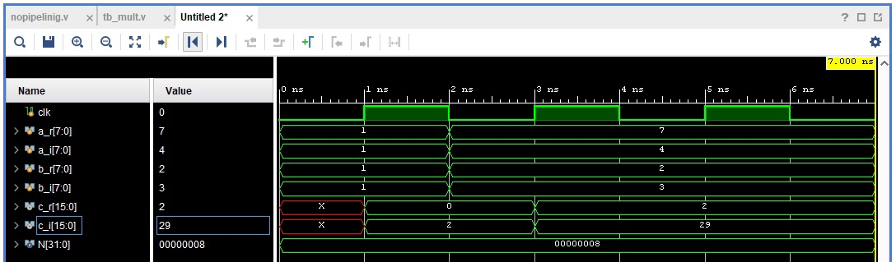

# Проектирование комплексного умножителя

### Первый этап

Для проектирования комплексного умножителя обратимся к такому ресурсу как DCPedia и найдём следующую информацию. 

<div align="center">
    <figure >
    
    <figcaption><center>Рисунок 1. Обычная реализация умножения комплексных чисел.</center></figcaption>
    </figure>
</div>

<div align="center">
    <figure >
    
    <figcaption><center>Рисунок 2. Альтерантивная реализация умножения комплексных чисел.</center></figcaption>
    </figure>
</div>

Из данных слайдов видно, что аппаратно выгоднее реализовать альтернативный вариант, так как он затрачивает меньше ресурсов.

### Второй этап

Сначала посмотрим на то, сколько ресурсов затрачивает обычный вариант. Перемножать будем 8-разрядные числа. 

```verilog
module nopipelining  #(parameter N = 8) ( 
  input clk, 
  input wire signed [  N-1 : 0] a_r, 
  input wire signed [  N-1 : 0] a_i, 
  input wire signed [  N-1 : 0] b_r, 
  input wire signed [  N-1 : 0] b_i, 
  output reg signed [2*N-1 : 0] c_r, 
  output reg signed [2*N-1 : 0] c_i);
  // код не нуждается в комментариях
  always @(posedge clk)
    begin
      c_r <= a_r * b_r - a_i * b_i;
      c_i <= a_r * b_i + a_i * b_r;
    end
    
endmodule

```

Данное описание является самым простым и, в то же время, худшим с точки зрения используемых ресурсов и быстродействия схемы. 

<div align="center">
    <figure >
    
    <figcaption><center>Рисунок 3. RTL Schematic обычной реализации умножения комплексных чисел.</center></figcaption>
    </figure>
</div>

<div align="center">
    <figure >
    
    <figcaption><center>Рисунок 4. Временная диаграмма получившегося умножителя.</center></figcaption>
    </figure>
</div>

Видно, что данные на выходе обновляются по фронту тактового сигнала. 

Для того, чтобы посмотреть критический путь данной схемы создадим constraint файл, содержащий в себе следующую строку:

```verilog
create_clock -period 10.000 -name clk -waveform {0.000 5.000} [get_ports clk]
```

То есть будем првоерять, заработает ли наша схема на тактовой частоте в 100 МГц. Делать мы это будем используя ZedBoard Zynq Evaluation and Development Kit (xc7z020clg484-1). 

<div align="center">
    <figure >
    
    <figcaption><center>Рисунок 5. Implemented design обычной реализации умножения комплексных чисел с указанием критического пути.</center></figcaption>
    </figure>
</div>

Мы видим, что наш умножитель может работать на такой частоте, потому что некоторый запас (clack) имеется, однако он слишком мал для стабильной работы схемы, а уж тем более для работы на более высоких частотах. Зафиксируем значение Total Delay на первоначальной реализации = 7.737 нс. 

Попробуем реализовать альтернативный вариант умножения и сравнить результаты. Ниже приведёна только изменённая часть кода. 

```verilog
  wire signed [2*N-1 : 0] mult1;
  wire signed [2*N-1 : 0] mult2;
  // дополнительные провода нужны только для упрощения записи
  assign mult1 = a_r * b_r;
  assign mult2 = a_i * b_i;
  // выход по-прежнему является регистром
  always @(posedge clk)
    begin
      c_r <= mult1 - mult2;
      c_i <= (a_r + a_i) * (b_r + b_i) - mult1 - mult2;
    end
```

На рисунке ниже представлен RTL Schematic получишегося модуля.

<div align="center">
    <figure >
    
    <figcaption><center>Рисунок 6. RTL Schematic альтернативной реализации умножения комплексных чисел.</center></figcaption>
    </figure>
</div>

Результаты Behaviour Simulation не отличаются от тех, что получились в пермо случае.

С тем же constraint файлом посмотрим на имплементированный дизайн.

<div align="center">
    <figure >
    
    <figcaption><center>Рисунок 7. Implemented design альтернативной реализации умножения комплексных чисел с указанием критического пути.</center></figcaption>
    </figure>
</div>

Почему-то в данной ситуации Vivado не захотел отображать критический путь, в других случаях всё отображалось корректно, найти причину этого мне не удалось.

### Третий этап

Для увеличения потенциальной тактовой частоты схемы реализуем простую идею вставки в нашу схему одного промежуточного регистра, который разделит её на две части. Изменённая часть кода приведена ниже.

```verilog
  reg [0:2*N-1] temp [2 : 0];
  always @(posedge clk)
    begin
      temp[0] <= a_r * b_r;
      temp[1] <= a_i * b_i;
      temp[2] <= (a_r + a_i) * (b_r + b_i);
    end
  // в регистре temp вычисляются промежуточные значения 
  always @(posedge clk)
    begin
      c_r <= temp[0] - temp[1];                            
      c_i <= temp[2] - temp[0] - temp[1];
    end  
```

Таким образом, результат будет вычислять позже на 1 такт, но, потенциально, схема сможет работать на более высокой частоте.

<div align="center">
    <figure >
    
    <figcaption><center>Рисунок 8. RTL Schematic альтернативной реализации умножения комплексных чисел с одним промежуточным регистром.</center></figcaption>
    </figure>
</div>

<div align="center">
    <figure >
    
    <figcaption><center>Рисунок 9. Временная диаграма 1-стадийного конвейерного умножителя.</center></figcaption>
    </figure>
</div>

<div align="center">
    <figure >
    
    <figcaption><center>Рисунок 10. Implemented design альтернативной реализации умножения комплексных чисел с одним промежуточным регистром с указанием критического пути.</center></figcaption>
    </figure>
</div>

Как мы видим, критический путь уменьшился с 7.737 нс до 3.482 нс, однако мы можем добиться лучшего результата, введя больше промежуточных регистров.

### Четвертый этап

Реализуем 3-х стадийную конвейеризацию умножения следующим образом. На каждой стадии конвейера будут использоваться данные только с прошлой стадии. Если данные не используются на какой-то стадии, они перезаписываются в следующий буферный регистр.

```verilog
  reg [0:2*N-1] stage0 [5 : 0];
  always @(posedge clk)
    begin
      stage0[0] <= a_r + a_i;
      stage0[1] <= b_r + b_i;
      stage0[2] <= a_r; 
      stage0[3] <= a_i; 
      stage0[4] <= b_r; 
      stage0[5] <= b_i; 
    end
// на первой стадии реализовано два сложения и буферизация входных данных 
  reg [0:2*N-1] stage1 [2 : 0];
  always @(posedge clk)
    begin
      stage1[0] <= stage0[2] * stage0[4];
      stage1[1] <= stage0[3] * stage0[5];
      stage1[2] <= stage0[0] * stage0[1];
    end
// на второй стадии реализованы умножения данных между собой по известным формулам 
reg [0:2*N-1] stage2 [2 : 0];
always @(posedge clk)
	begin
		stage2[0] <= stage1[0] - stage1[1]; 
		stage2[1] <= stage1[2] - stage1[0]; 
		stage2[2] <= stage1[1];
	end
// на третьей стадии реализованы две разности и одна буферизация 
always @(posedge clk)
	begin
		c_r <= stage2[0];                            
		c_i <= stage2[1] - stage2[2];
	end  
```

<div align="center">
    <figure >
    
    <figcaption><center>Рисунок 11. RTL Schematic альтернативной реализации умножения комплексных чисел с 3-х стадийной конвейеризацией.</center></figcaption>
    </figure>
</div>

<div align="center">
    <figure >
    
    <figcaption><center>Рисунок 12. Временная диаграма 3-стадийного конвейерного умножителя.</center></figcaption>
    </figure>
</div>

<div align="center">
    <figure >
    
    <figcaption><center>Рисунок 13. Implemented design альтернативной реализации умножения комплексных чисел с 3-х стадийной конвейеризацией с указанием критического пути.</center></figcaption>
    </figure>
</div>

Мы добились значительных улучшений, значительно уменьшился не только критический путь: с первоначальных 7.737 нс до 1.407 нс, но и использование элементарных ячеек: с 612 до 112. Теперь схема может работать на частоте и в 200 и в 300 МГц, а конвейеризация однозначно нивелирует выходную задержку в 3 такта. 

Не будем останавливаться на этом и попробуем усложнить схему, добавив в неё сигнал сброса. Начнём с реализации синхронного сброса, не будем приводить код в силу его по большей части повторения, перейдём сразу к получившимся схемам. На рисунке ниже показан RTL Schematic для той же схему с одним лишь изменением - к каждому регистру подведён сигнал сброса, синтезатор это видит и определяет его как RTL_REG_SYNC.

<div align="center">
    <figure >
    
    <figcaption><center>Рисунок 14. RTL Schematic альтернативной реализации умножения комплексных чисел с 3-х стадийной конвейеризацией и синхронным сбросом.</center></figcaption>
    </figure>
</div>

При проведении Behaviour Simulation всё работает корректно.

<div align="center">
    <figure >
    
    <figcaption><center>Рисунок 15. Временная диаграма 3-стадийного конвейерного умножителя с синхронным сбросом.</center></figcaption>
    </figure>
</div>

Имплементация данной схемы почти не отличается от предыдущей реализации, за исключением необъяснимого небольшого уменьшения критического пути (с 1.407 нс до 1.308 нс).

<div align="center">
    <figure >
    
    <figcaption><center>Рисунок 16. Implemented design альтернативной реализации умножения комплексных чисел с 3-х стадийной конвейеризацией с синхронным сбросом с указанием критического пути.</center></figcaption>
    </figure>
</div>

Однако Post-Implementation Timing Simulation показывает странные результаты, первые два результата умножения куда-то "уплыли", спустя время на экране появился только последний, удалось немного отследить его продвижение по стадиям конвейера.

<div align="center">
    <figure >
    
    <figcaption><center>Рисунок 17. Post-Implementation Timing Simulation</center></figcaption>
    </figure>
</div>

Можно ли считать реализацию конвейера неудачной? Не берусь утверждать.

Попробуем реализовать в конвейере асинхронный сброс. С кодом всё опять же очевидно, на RTL Schematic регистры отобразились как RTL_REG_ASYNC.

<div align="center">
    <figure >
    
    <figcaption><center>Рисунок 18. RTL Schematic альтернативной реализации умножения комплексных чисел с 3-х стадийной конвейеризацией и асинхронным сбросом.</center></figcaption>
    </figure>
</div>

Более подробный взгляд на Behaviour Simulation позволяет нам увидеть, как продвигаются данные по стадиям конвейера.

<div align="center">
    <figure >
    
    <figcaption><center>Рисунок 19. Временная диаграма 3-стадийного конвейерного умножителя с асинхронным сбросом.</center></figcaption>
    </figure>
</div>

Результаты имплементации сильно удивляют, значительно увеличилось число используемых ячеек, возрос критический путь (с 1.308 нс при синхронном сбросе до 1.430 нс), однако использоваться стало ровно столько DSP-блоков, сколько и умножений в схеме, то есть ровно 3.

<div align="center">
    <figure >
    
    <figcaption><center>Рисунок 20. Implemented design альтернативной реализации умножения комплексных чисел с 3-х стадийной конвейеризацией с асинхронным сбросом с указанием критического пути.</center></figcaption>
    </figure>
</div>

На временных диаграммах после имплементации в общем и целом ситуация та же, что и при синхронном сбросе, разобраться как это исправить не удалось.

Интерес представляют timing report, которые даёт Vivado после имплементации, в них ещё нагляднее видна разница в используемых ресурсах при синхронном и асинхронном сбросе. Нас будет интересовать только часть этих отчётов. В первом приведены данные для синхронного сброса.

```
1. Slice Logic
--------------

+-------------------------+------+-------+-----------+-------+
|        Site Type        | Used | Fixed | Available | Util% |
+-------------------------+------+-------+-----------+-------+
| Slice LUTs              |   16 |     0 |     53200 |  0.03 |
|   LUT as Logic          |   16 |     0 |     53200 |  0.03 |
|   LUT as Memory         |    0 |     0 |     17400 |  0.00 |
| Slice Registers         |   16 |     0 |    106400 |  0.02 |
|   Register as Flip Flop |   16 |     0 |    106400 |  0.02 |
|   Register as Latch     |    0 |     0 |    106400 |  0.00 |
| F7 Muxes                |    0 |     0 |     26600 |  0.00 |
| F8 Muxes                |    0 |     0 |     13300 |  0.00 |
+-------------------------+------+-------+-----------+-------+


1.1 Summary of Registers by Type
--------------------------------

+-------+--------------+-------------+--------------+
| Total | Clock Enable | Synchronous | Asynchronous |
+-------+--------------+-------------+--------------+
| 0     |            _ |           - |            - |
| 0     |            _ |           - |          Set |
| 0     |            _ |           - |        Reset |
| 0     |            _ |         Set |            - |
| 0     |            _ |       Reset |            - |
| 0     |          Yes |           - |            - |
| 0     |          Yes |           - |          Set |
| 0     |          Yes |           - |        Reset |
| 0     |          Yes |         Set |            - |
| 16    |          Yes |       Reset |            - |
+-------+--------------+-------------+--------------+


2. Slice Logic Distribution
---------------------------

+--------------------------------------------+------+-------+-----------+-------+
|                  Site Type                 | Used | Fixed | Available | Util% |
+--------------------------------------------+------+-------+-----------+-------+
| Slice                                      |   10 |     0 |     13300 |  0.08 |
|   SLICEL                                   |    2 |     0 |           |       |
|   SLICEM                                   |    8 |     0 |           |       |
| LUT as Logic                               |   16 |     0 |     53200 |  0.03 |
|   using O5 output only                     |    0 |       |           |       |
|   using O6 output only                     |   14 |       |           |       |
|   using O5 and O6                          |    2 |       |           |       |
| LUT as Memory                              |    0 |     0 |     17400 |  0.00 |
|   LUT as Distributed RAM                   |    0 |     0 |           |       |
|   LUT as Shift Register                    |    0 |     0 |           |       |
| Slice Registers                            |   16 |     0 |    106400 |  0.02 |
|   Register driven from within the Slice    |    0 |       |           |       |
|   Register driven from outside the Slice   |   16 |       |           |       |
|     LUT in front of the register is unused |   16 |       |           |       |
|     LUT in front of the register is used   |    0 |       |           |       |
| Unique Control Sets                        |    1 |       |     13300 | <0.01 |
+--------------------------------------------+------+-------+-----------+-------+
```

Во втором - для асинхронного:

```
1. Slice Logic
--------------

+-------------------------+------+-------+-----------+-------+
|        Site Type        | Used | Fixed | Available | Util% |
+-------------------------+------+-------+-----------+-------+
| Slice LUTs              |   72 |     0 |     53200 |  0.14 |
|   LUT as Logic          |   72 |     0 |     53200 |  0.14 |
|   LUT as Memory         |    0 |     0 |     17400 |  0.00 |
| Slice Registers         |  131 |     0 |    106400 |  0.12 |
|   Register as Flip Flop |  131 |     0 |    106400 |  0.12 |
|   Register as Latch     |    0 |     0 |    106400 |  0.00 |
| F7 Muxes                |    0 |     0 |     26600 |  0.00 |
| F8 Muxes                |    0 |     0 |     13300 |  0.00 |
+-------------------------+------+-------+-----------+-------+


1.1 Summary of Registers by Type
--------------------------------

+-------+--------------+-------------+--------------+
| Total | Clock Enable | Synchronous | Asynchronous |
+-------+--------------+-------------+--------------+
| 0     |            _ |           - |            - |
| 0     |            _ |           - |          Set |
| 0     |            _ |           - |        Reset |
| 0     |            _ |         Set |            - |
| 0     |            _ |       Reset |            - |
| 0     |          Yes |           - |            - |
| 0     |          Yes |           - |          Set |
| 131   |          Yes |           - |        Reset |
| 0     |          Yes |         Set |            - |
| 0     |          Yes |       Reset |            - |
+-------+--------------+-------------+--------------+


2. Slice Logic Distribution
---------------------------

+--------------------------------------------+------+-------+-----------+-------+
|                  Site Type                 | Used | Fixed | Available | Util% |
+--------------------------------------------+------+-------+-----------+-------+
| Slice                                      |   30 |     0 |     13300 |  0.23 |
|   SLICEL                                   |   12 |     0 |           |       |
|   SLICEM                                   |   18 |     0 |           |       |
| LUT as Logic                               |   72 |     0 |     53200 |  0.14 |
|   using O5 output only                     |    0 |       |           |       |
|   using O6 output only                     |   32 |       |           |       |
|   using O5 and O6                          |   40 |       |           |       |
| LUT as Memory                              |    0 |     0 |     17400 |  0.00 |
|   LUT as Distributed RAM                   |    0 |     0 |           |       |
|   LUT as Shift Register                    |    0 |     0 |           |       |
| Slice Registers                            |  131 |     0 |    106400 |  0.12 |
|   Register driven from within the Slice    |   82 |       |           |       |
|   Register driven from outside the Slice   |   49 |       |           |       |
|     LUT in front of the register is unused |   22 |       |           |       |
|     LUT in front of the register is used   |   27 |       |           |       |
| Unique Control Sets                        |    1 |       |     13300 | <0.01 |
+--------------------------------------------+------+-------+-----------+-------+
```

Видно, что 16 регистров с синхронным сбросом превратились в 131 регистр с асинхронным сбросом. Остальные результаты я проанализировать не могу в силу недостатка опыта и знаний.